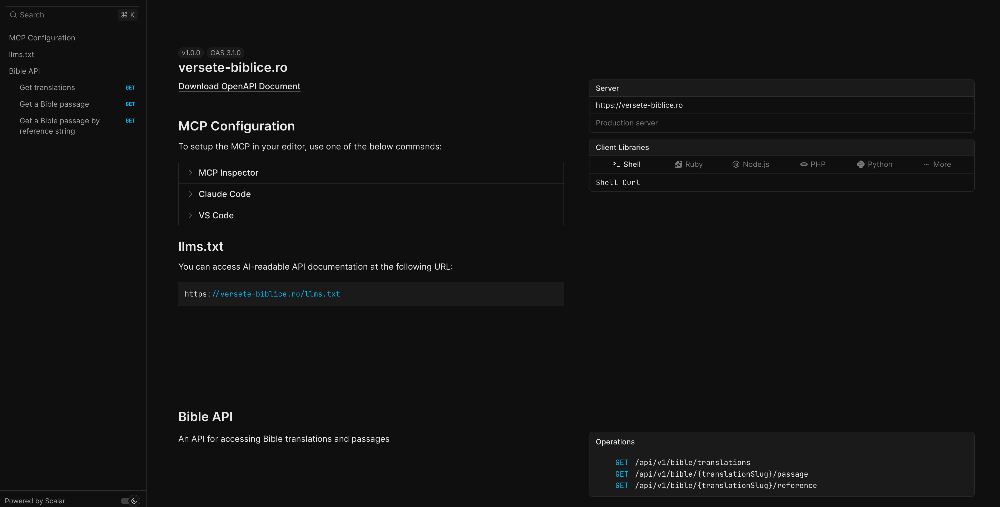

# versete-biblice.ro

A Bible resource API providing passages and translations in multiple languages, accessible via multiple protocols (MCP, REST API, and llms.txt).

Check out the live application at [versete-biblice.ro](https://versete-biblice.ro).

[](https://versete-biblice.ro)

## Features

- **MCP Server**: Model Context Protocol server for AI assistants to access Bible passages
- **llms.txt**: Standardized LLM documentation endpoint for AI discoverability
- **OpenAPI**: RESTful API with OpenAPI specification for Bible verse retrieval

## Developer Setup

1. Copy the environment variables template:
   ```bash
   cp .env.example .env
   ```

2. Install dependencies:
   ```bash
   pnpm install
   ```

3. Initialize the database:
   ```bash
   pnpm run db:push
   ```

4. Start the development server:
   ```bash
   pnpm run dev:wrangler
   ```
